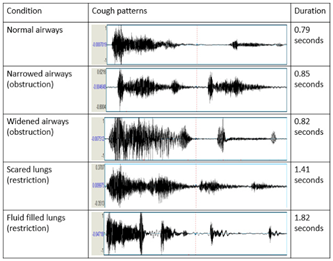
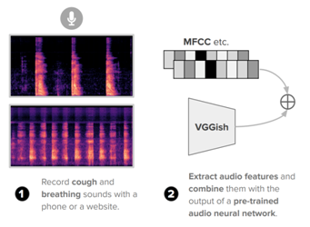

# breatheAI
check it out here: https://breatheai.streamlit.app/
## Overview

This project aims to detect cough sounds from an audio file using machine learning. The model is trained on a dataset containing metadata and 31 audio features extracted from 3029 rows of data sourced from Kaggle. The model employs a Gradient Boosting classifier to predict the likelihood of a cough being detected in the given audio input.

## Features

- **Audio Processing**: The system processes audio files (in various formats such as `.m4a`, `.obb`, `.webm`, `.mp3`, `.flac`) and extracts relevant audio features for prediction.
- **Feature Extraction**: Extracts 31 features, including Mel-frequency cepstral coefficients (MFCCs), chroma, and spectral contrast, using the `librosa` library.
- **Machine Learning Model**: Uses a Gradient Boosting classifier (`gbm_model.pkl`), trained on a Kaggle dataset with metadata and audio features.
- **Prediction**: After feature extraction, the model predicts the likelihood of a cough being present in the given audio file.
- **Scalability**: The system works on individual audio files and can be used for batch processing by calling the function multiple times.

<p align="center">
    
     
  
</p>


## Requirements

Before running the project, make sure you have the following dependencies installed:

- Python 3.x
- Libraries:
  - `librosa`: For audio processing
  - `numpy`: For handling arrays and numerical operations
  - `pydub`: For audio file format conversion
  - `scikit-learn`: For machine learning and model prediction
  - `pickle`: For saving and loading the trained model
  - `ffmpeg`: For audio file conversion
  - `pandas`: For handling data frames (if needed for preprocessing)

Install the dependencies using the following:


## Dataset

The model was trained on a dataset from Kaggle, consisting of 3029 rows of metadata and 31 audio features. These features were extracted from raw audio files representing a variety of sounds, including coughs.

### Data Features:
- Mel-frequency cepstral coefficients (MFCCs)
- Chroma spectral features
- Spectral contrast

## Usage

1. **Prepare the Audio File**: Place the audio file you want to process in a directory. Supported file formats include `.m4a`, `.obb`, `.webm`, `.mp3`, and `.flac`.
   
2. **Run the Script**: Replace the file path in the `audio_file` variable with the path to your audio file and run the script.

```python
audio_file = '/path/to/your/audio/file.m4a'  # Path to your audio file
predict_from_audio(audio_file)
```
3. **Run the modeluse.py** file with the updated location of the model and scaler files, and update the input audio. Terminal will show the result as cough_detected %


## contact

Made with ❤️ by Jvalaj.  
[LinkedIn](https://www.linkedin.com/in/jvalaj/)

